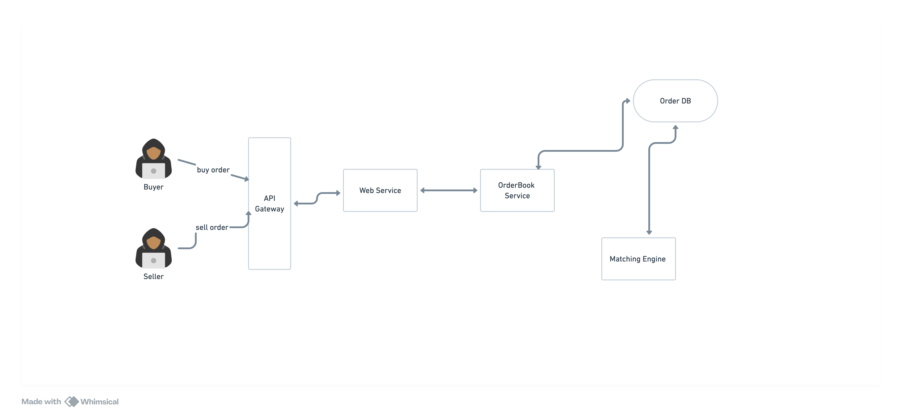

# uAsset Matching Engine



The uAsset Matching Engine is a core component of the Universal Exchange, responsible for efficiently matching buy and sell orders for uAssets (wrapped assets that facilitate cross-chain trading).  Its primary function is to maintain an order book, which is a real-time record of all active buy and sell orders for a given uAsset. 

Here's a breakdown of the key functionalities of the uAsset Matching Engine:

### Order Placement:
When a trader places an order to buy or sell a uAsset, the Matching Engine receives the order details, including the uAsset symbol, order side (buy or sell), quantity, and price. The engine then adds this order to its order book, ensuring that the order book is always up-to-date with the latest trading activity.    

### Order Matching:
The engine continuously monitors the order book for potential matches between buy and sell orders. 
A match occurs when there's a buy order and a sell order with compatible prices and quantities. 
For example, if there's a buy order for 1 uBTC at $30,000 and a sell order for 1 uBTC $30,000, the engine would match these two orders.   

### Trade Execution:
Once a match is found, the Matching Engine executes the trade, transferring the uAssets from the seller to the buyer and updating their respective account balances (hypothetically). The engine ensures that this trade execution happens atomically, meaning that either both sides of the trade are completed successfully, or the entire trade is rolled back to prevent any loss of funds.    

### Order Book Maintenance:
After a trade is executed, the Matching Engine updates the order book to reflect the changes in order status and available quantities. 
If an order is fully fulfilled, the status is updated to `fulfilled`.
If an order is partially fulfilled, its remaining quantity is updated accordingly.

## Installation

#### Pre-requisite

* Ensure you have git, node and npm installed on your machine

#### Step 1
* Clone this repo on your local machine
```
git clone git@github.com:rovilay/uAsset-matching-engine.git
```

#### Step 2
* Change directory to the project
```
cd uasset-matching-engine
```

#### Step 3
* Run npm install
```
npm install
```

#### Step 4
* create your .env file by following the `.env.sample` file
```
touch .env
```

#### Step 5
* Run db migration
```
npm run db:migrate
```

#### Step 6
* Generate prisma client
```
npm run db:generate-client
```

#### Step 7
* Start the server. The server should be running on port 3000
```
npm run dev
```


## Endpoints

### 1. Create Order

**POST /api/v1/orders**

Creates a new order in the order book.

**Request Body**

```json
{
  "uassetSymbol": "uBTC", // Supported uAsset symbol (e.g., uBTC, uETH)
  "side": "buy", // Order side ("buy" or "sell")
  "quantity": 1.5, // Order quantity (positive number)
  "price": 30000 // Order price (positive number)
}
```

**Response**
```json
{
  "data": {
    "id": "some-uuid",
    "uassetSymbol": "uBTC",
    "side": "buy",
    "initialQuantity": 1.5,
    "quantity": 1.5,
    "price": 30000,
    "status": "open",
    "createdAt": "2024-01-24T15:11:00.000Z"
  }
}
```

### 2. Get Orders

**GET /api/v1/orders**

Retrieves a list of orders with optional filtering.

**Query Parameters**

* **uassetSymbol**: Filter by uAsset symbol (e.g., uBTC).
* **side**: Filter by order side (buy or sell).
* **status**: Filter by order status (open, fulfilled, cancelled).

**Response**

200 OK: Orders retrieved successfully.

```json
{
  "data": [
    {
        "id": "some-uuid",
        "uassetSymbol": "uBTC",
        "side": "buy",
        "initialQuantity": 1.5,
        "quantity": 1.5,
        "price": 30000,
        "status": "open",
        "createdAt": "2024-01-24T15:11:00.000Z"
    }
  ]
}
```

* 500 Internal Server Error: Failed to retrieve orders.


### 3. Get Order

**GET /api/v1/orders/:orderId**

Retrieves an order by ID.

**Response**

* 200 OK: Order retrieved successfully.

```json
{
  "data": {
        "id": "some-uuid",
        "uassetSymbol": "uBTC",
        "side": "buy",
        "initialQuantity": 1.5,
        "quantity": 1.5,
        "price": 30000,
        "status": "open",
        "createdAt": "2024-01-24T15:11:00.000Z"
    }
}
```

* 400 Bad Request: Invalid order ID.

### 4. Cancel Order

**PATCH /api/v1/orders/:orderId/cancel**

Cancels an existing order by ID.

**Response**

* 200 OK: Order cancelled successfully.

```json
{
  "data": {
        "id": "some-uuid",
        "uassetSymbol": "uBTC",
        "side": "buy",
        "initialQuantity": 1.5,
        "quantity": 1.5,
        "price": 30000,
        "status": "cancelled",
        "createdAt": "2024-01-24T15:11:00.000Z"
    }
}
```

* 400 Bad Request: Invalid order ID.

## Future Improvements

* **User Service**: For user registration, login, secure authentication, and authorization. Also to create and monitor user's asset account and orders.
* **API Integration**: Integrate with the Universal API for real-time pricing, order execution, and balance updates.
  * Fetching real-time market data from the Universal API.
  * Handling order execution and settlement through the Universal API
* **Error Handling**: Add robust error handling and logging.
* **Performance Optimization**: 
  * Optimize the matching algorithm for high throughput and low latency.
  * Implementing caching strategies for frequently accessed data
* **Security**: Implement security measures to prevent unauthorized access and manipulation of the order book.